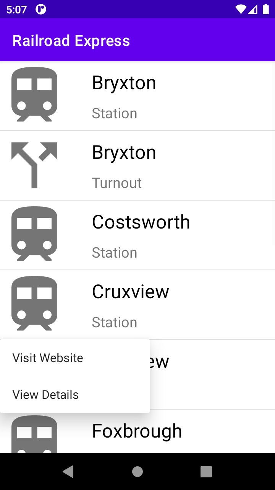
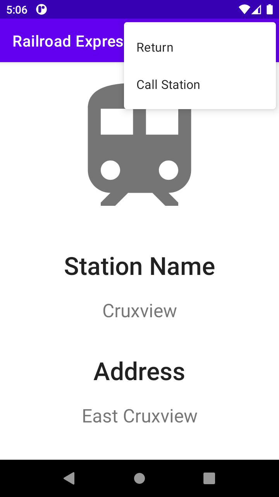

# RailroadExpress
Android Development mini project written in Kotlin.

# Screenshots
<table width="500" align="center">
    <tr>
        <td width="45%">
            
        </td>
        <td width="10%">
        </td>
        <td width="45%">
            
        </td>
    </tr>
</table>
